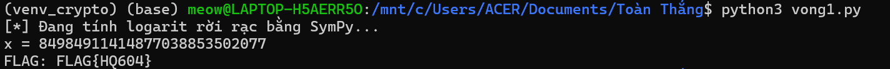

# Vòng 1 - Mệnh lệnh xuất kích
## Mô tả bài toán

Ở vòng này, đề bài cho biết flag đã được mã hóa thành một số nguyên bí mật x. Em được cung cấp ba giá trị p, g, h và quan hệ:
```
h = g^x mod p
```
Qua đó, nhiệm vụ của em là tìm lại giá trị x, sau đó chuyển x từ dạng số nguyên sang bytes để lấy được flag. 

Đây là dạng bài liên quan đến logarit rời rạc trong mật mã học. Đề bài cũng ghi rõ sau khi tìm được x thì cần convert integer sang bytes để lấy flag.

## Ý tưởng
Từ công thức:
```
h = g^x mod p
```
Ta thấy bài toán yêu cầu tìm số mũ x khi đã biết g, h và modulo p. Đây chính là bài toán Discrete Logarithm Problem.

Nếu làm thủ công thì gần như không khả thi vì các số p, g, h đều rất lớn. Vì vậy, em sử dụng thư viện SymPy, cụ thể là hàm:
```
discrete_log(p, h, g)
```

Hàm này dùng để tìm x sao cho:
```
g^x ≡ h (mod p)
```

Sau khi tìm được x, em đổi số nguyên này sang dạng byte thông qua công thức tính số byte tối thiểu cần thiết để biểu diễn số nguyên x.: ```(int(x).bit_length() + 7) // 8```

Sau đó, em dùng: ```to_bytes(..., byteorder="big")`` để chuyển x sang bytes theo thứ tự byte lớn trước và dùng ```.decode()``` để chuyển bytes thành chuỗi ký tự flag.

## Code 
```
from sympy.ntheory.residue_ntheory import discrete_log

p = 2247297901375864750461918215908397462554622316861885697469812609208482671796519989041708819088327406276727713325926984783654453580598954278480933663642628407743971547337698858815665335450301828703735517279088545252493204317839245564990751219121256870972082020870742841156981131437941510099651935803198999627

g = 797032223149531285607971355158192150926555680763341545661871333078567437408820428834941794887222745425244137303956776516613894961185972456200978813725184212858037439841778740577859187417009007458444768864113847557627519817788214445986970343968064264731545268364867143251499664214088696995903599781563984116

h = 468236306785559227242545208642961660487424736475509451324848496240713063884248400928453707063093512040762457493692466389598131256501402625717666645351148316070083773749717409678738689693550470750839264535543953759648092479282888291678698194889269011735062078161680411521433536665807130299043504305373037050

print("[*] Đang tính logarit rời rạc bằng SymPy...")

x = discrete_log(p, h, g)
print(f"x = {x}")

flag_bytes = int(x).to_bytes((int(x).bit_length() + 7) // 8, byteorder="big")
print(f"FLAG: {flag_bytes.decode(errors='ignore')}")
```
## Kết quả 

Sau khi chạy file Python, chương trình trả về:


Vì vậy, ta có Flag: `FLAG{HQ604}`