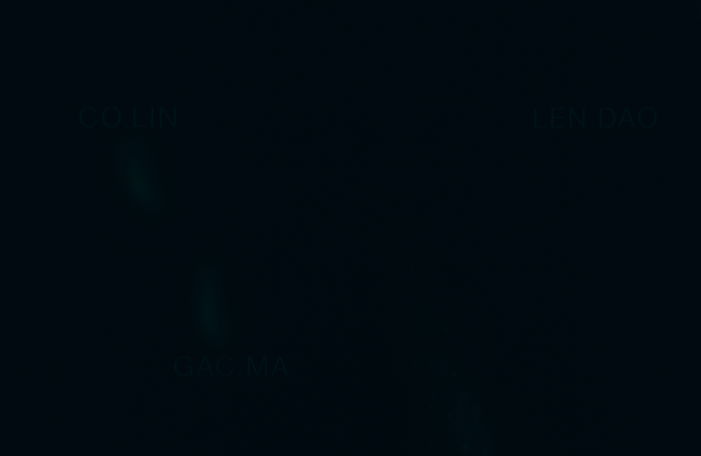
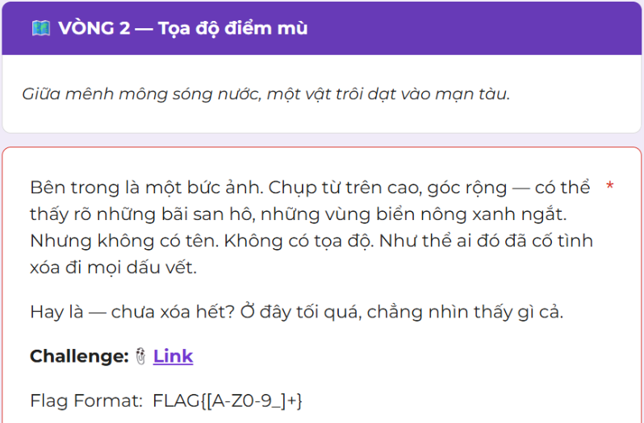
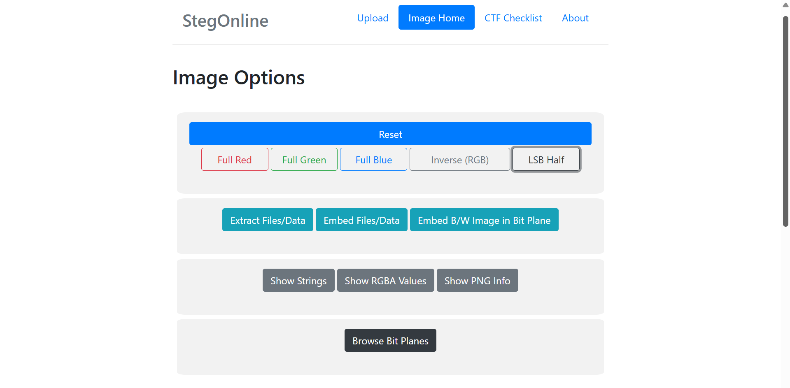
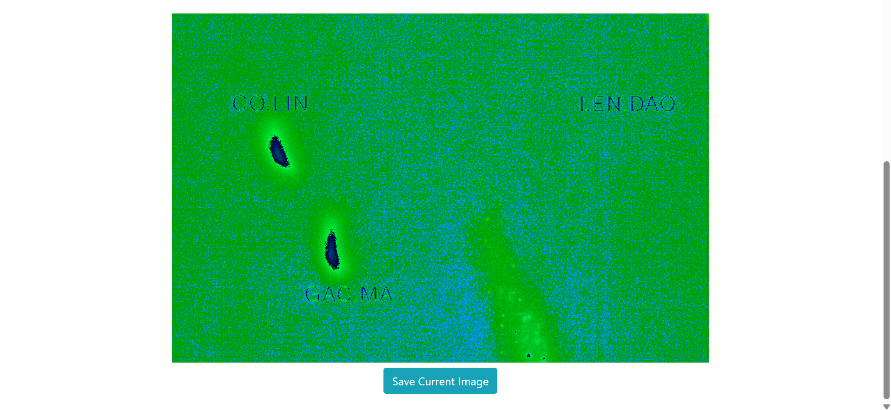

# Vòng 2
## Mô tả bài toán

Ở vòng này, đề bài cho biết hình ảnh sau:


Bên cạnh đó, thử thách còn cho ta gợi ý là ```Hay là - chưa xóa hết? Ở đây tối quá, chẳng nhìn thấy gì cả.```:


## Ý tưởng
Qua những thông tin mô tả trên, em đã dùng công cụ chuyên dụng StegOnline trên stegonline.georgeom.net và thực hiện LSB HALF để nhìn thấy rõ những manh mối trong bức ảnh:



Qua đó, em thấy được tên của 3 bãi đá san hô thuộc quần đảo Trường Sa của Việt Nam: Cô Lin, Gạc Ma, Len Đao.

Vì vậy, em đã thực hiện tìm FLAG bằng cách lần lượt sắp xếp tên của 3 bãi đá theo các thứ tự khác nhau.

## Kết quả 
```
FLAG: FLAG{GACMA_COLIN_LENDAO}
```