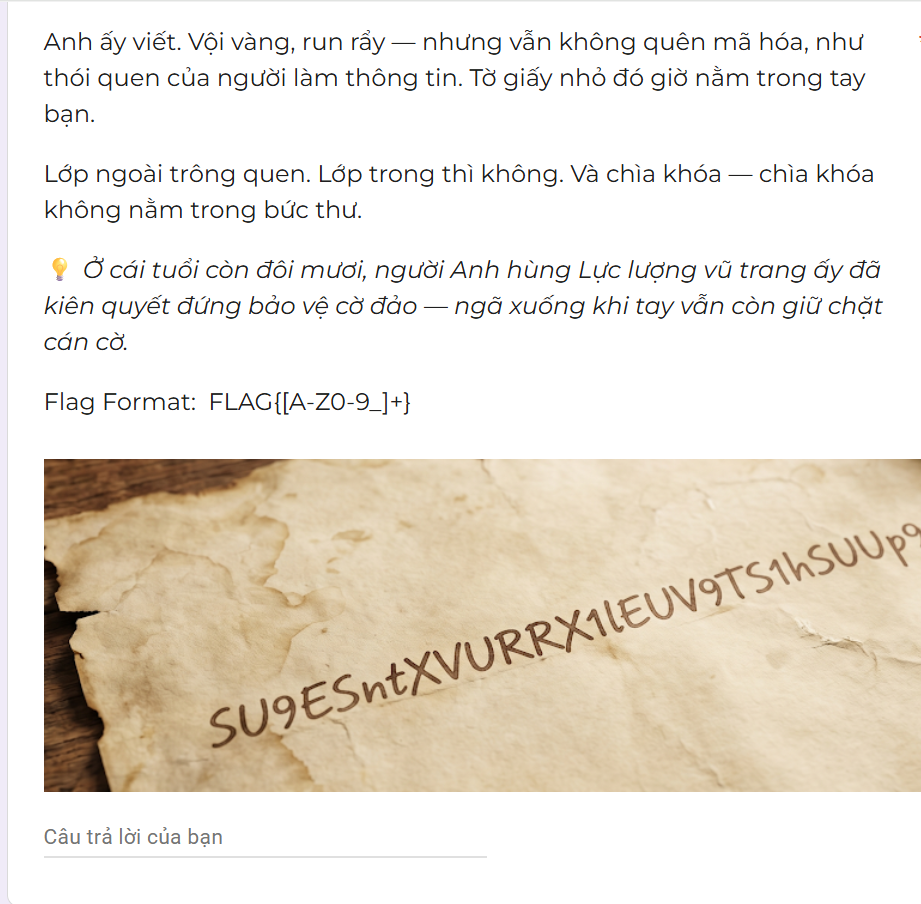
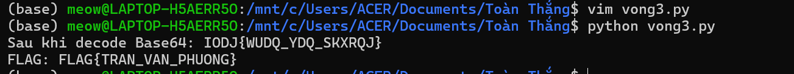

# Vòng 3 - Bức thư nhà gửi vội 
## Mô tả bài toán


Ở vòng này, đề bài cho một bức ảnh tờ giấy cũ, trên đó có một chuỗi ký tự: `SU9ESntXVURRX1lEUV9TS1hSUUp9`

Đề có gợi ý rằng `lớp ngoài trông quen, lớp trong thì không`, nghĩa là dữ liệu đã được mã hóa qua nhiều lớp. 

Ngoài ra, đề còn nhắc đến một người anh hùng lực lượng vũ trang đã hy sinh khi còn trẻ và vẫn giữ chặt cán cờ, đây là gợi ý liên quan đến Trần Văn Phương trong sự kiện Gạc Ma.

## Ý tưởng

Đầu tiên, em nhận thấy chuỗi:  `SU9ESntXVURRX1lEUV9TS1hSUUp9` có dạng rất giống Base64, vì nó chỉ gồm chữ cái, số và có độ dài phù hợp. Do đó, em thử decode Base64 trước.

Sau khi decode Base64, kết quả thu được là:
`IODJ{WUDQ_YDQ_SKXRQJ}`

Chuỗi này có cấu trúc rất giống flag, nhưng phần đầu là `IODJ` thay vì `FLAG`. Quan sát thấy nếu dịch từng chữ cái lùi 3 ký tự trong bảng chữ cái thì:
```
I -> F
O -> L
D -> A
J -> G
```
Vì vậy, lớp mã hóa thứ hai là Caesar Cipher với độ dịch `+3`, khi giải mã thì cần dịch ngược lại `-3`.

## Code 
```
import base64

cipher_text = "SU9ESntXVURRX1lEUV9TS1hSUUp9"

# Bước 1: Decode lớp ngoài bằng Base64
decoded = base64.b64decode(cipher_text).decode()
print("[+] Sau khi decode Base64:", decoded)

# Bước 2: Giải Caesar Cipher
def caesar_decrypt(text, shift):
    result = ""

    for ch in text:
        if "A" <= ch <= "Z":
            # Dịch chữ cái lùi shift ký tự
            new_char = chr((ord(ch) - ord("A") - shift) % 26 + ord("A"))
            result += new_char
        else:
            # Giữ nguyên các ký tự như {, }, _
            result += ch

    return result

flag = caesar_decrypt(decoded, 3)

print("FLAG:", flag)
```
## Kết quả
Sau khi chạy file Python, chương trình trả về:

Vì vậy, ta có được Flag: `
FLAG{TRAN_VAN_PHUONG}`

