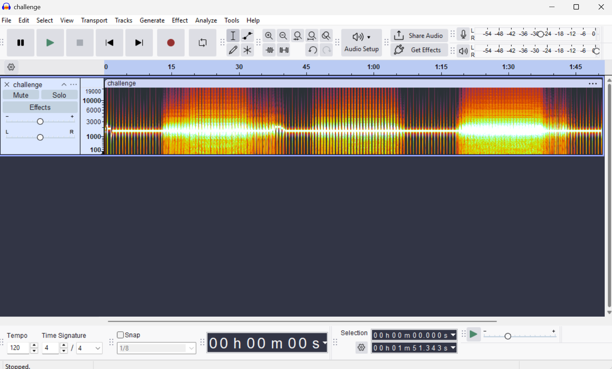
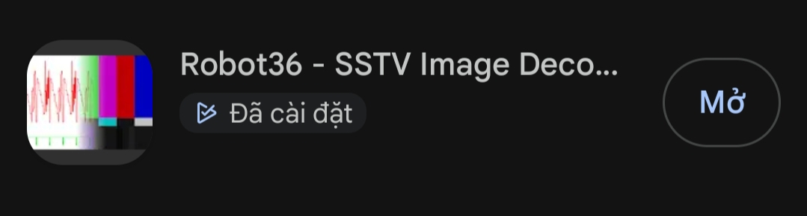
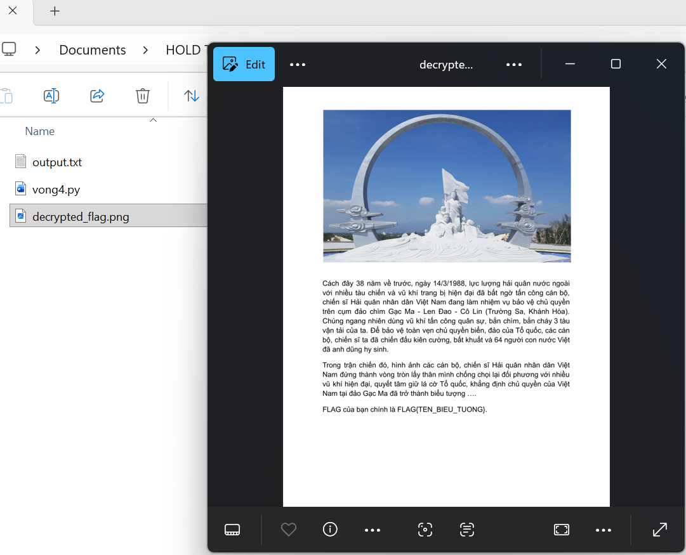

# Vòng 4 - Vòng tròn bất tử
## Mô tả bài toán


Ở vòng 4, đề bài cung cấp một file âm thanh `challenge.wav` kèm thông tin `sóng radio chỉ còn tiếng rè` và `bạn cần nghe bằng một cách khác`.

## Ý tưởng
Đầu tiên, em mở file challenge.wav bằng Audacity và chuyển sang chế độ Spectrogram. 



Tín hiệu hiện ra có dạng các dải quét đều nhau, giống tín hiệu SSTV. Vì vậy, em không nghe nội dung bằng tai mà dùng ứng dụng `Robot36 - SSTV Image Decoder` trên điện thoại Android để giải mã.



Em mở `Robot36 - SSTV Image Decoder` trên điện thoại, sau đó phát file `challenge.wav` trên laptop. Điện thoại được đặt gần loa laptop để ứng dụng thu âm trực tiếp tín hiệu phát ra. Thông qua đó, ứng dụng sẽ tự nhận dạng tín hiệu SSTV và dựng lại hình ảnh theo từng dòng quét. Sau khi quá trình decode hoàn tất, em thu được đường dẫn `https://drive.google.com/drive/folders/1n8-racMQqzE1kb3KUVuFlZgSWBftaBlk`


Khi truy cập vào đường dẫn trên, em được 2 file: `chall.py` và `output.txt`. 

Khi phân tích `chall.py`:
```
import os
from Crypto.Cipher import AES

KEY = ?
class AES_CTR:
    def __init__(self, key, step_up=False):
        self.key = key
        self.cipher_core = AES.new(self.key, AES.MODE_ECB)
        
        self.value = os.urandom(16).hex()
        self.step = 1
        self.stup = step_up

    def increment(self):
        if self.stup:
            self.newIV = hex(int(self.value, 16) + self.step)
        else:
            self.newIV = hex(int(self.value, 16) - self.stup) 
            
        self.value = self.newIV[2:len(self.newIV)]
        counter_block = bytes.fromhex(self.value.zfill(32))
        
        return self.cipher_core.encrypt(counter_block)

    def encrypt(self, data: bytes) -> bytes:
        out = bytearray()
        
        for i in range(0, len(data), 16):
            block = data[i:i+16]
            keystream = self.increment()
            
            xored = bytes(a ^ b for a, b in zip(block, keystream))
            out.extend(xored)
            
        return bytes(out)


def encrypt_challenge():

    cipher = AES_CTR(KEY, step_up=False)

    with open("flag.png", 'rb') as f:
        plaintext = f.read()

    ciphertext = cipher.encrypt(plaintext)

    encrypted_hex = ciphertext.hex()  
    with open("output.txt", 'w') as f:
        f.write(encrypted_hex)

encrypt_challenge()
```

Em thấy chương trình dùng AES ở chế độ CTR tự cài đặt để mã hóa file `flag.png`. Tuy nhiên, phần tăng counter bị lỗi:
`cipher = AES_CTR(KEY, step_up=False)`

Trong hàm `increment()`:
```
else:
    self.newIV = hex(int(self.value, 16) - self.stup)
```
Vì `self.stup = False`, mà trong Python False có giá trị là 0, nên dòng trên tương đương:
`self.newIV = hex(int(self.value, 16) - 0)`

Điều này làm cho `counter` không thay đổi sau mỗi block. Kết quả là cùng một keystream 16 bytes được dùng lặp lại để mã hóa toàn bộ file.

Dựa trên mã nguồn trên, ta biết được file gốc là PNG nên ta biết trước 16 byte đầu của file PNG:
`b"\x89PNG\r\n\x1a\n\x00\x00\x00\rIHDR"`

Do đó, em lấy 16 byte đầu của ciphertext XOR với PNG header để khôi phục keystream. Sau đó dùng keystream này XOR lại toàn bộ ciphertext để lấy lại ảnh gốc.

# Code
```
from pathlib import Path

# Đọc ciphertext dạng hex từ file output.txt
cipher_hex = Path("output.txt").read_text().strip()
ciphertext = bytes.fromhex(cipher_hex)

# PNG header chuẩn 16 byte đầu
png_header = b"\x89PNG\r\n\x1a\n" + (13).to_bytes(4, "big") + b"IHDR"

# Do keystream 16 byte bị lặp lại,
# ta khôi phục keystream bằng cách XOR ciphertext đầu với PNG header
keystream = bytes(c ^ p for c, p in zip(ciphertext[:16], png_header))

# Giải mã toàn bộ ciphertext
plaintext = bytearray()

for i in range(0, len(ciphertext), 16):
    block = ciphertext[i:i+16]
    decrypted_block = bytes(c ^ k for c, k in zip(block, keystream))
    plaintext.extend(decrypted_block)

# Ghi ảnh đã giải mã ra file
Path("decrypted_flag.png").write_bytes(plaintext)
```
## Kết quả
Sau khi chạy chương trình, em thu được file ảnh decrypted_flag.png. Khi mở ảnh đã giải mã, nội dung trong ảnh gợi ý đến biểu tượng Vòng tròn bất tử.


Qua đó, ta có Flag: `FLAG{VONG_TRON_BAT_TU}`