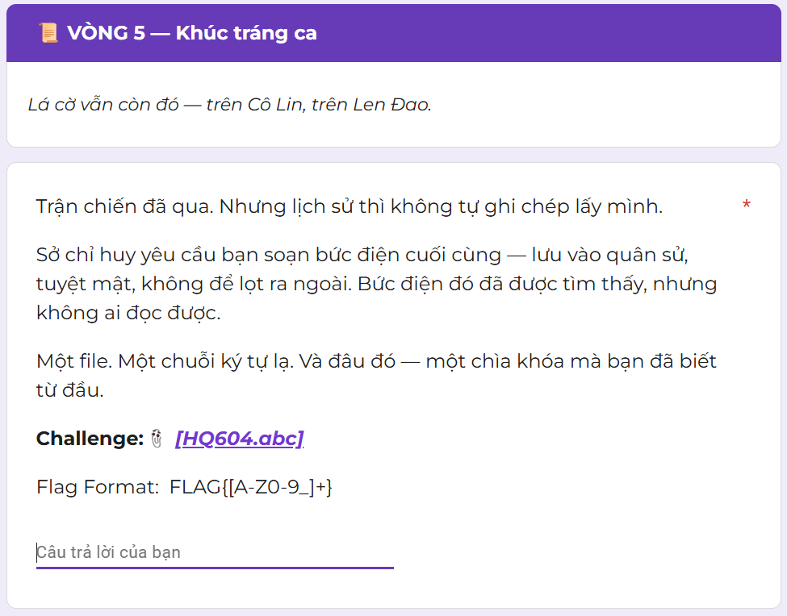
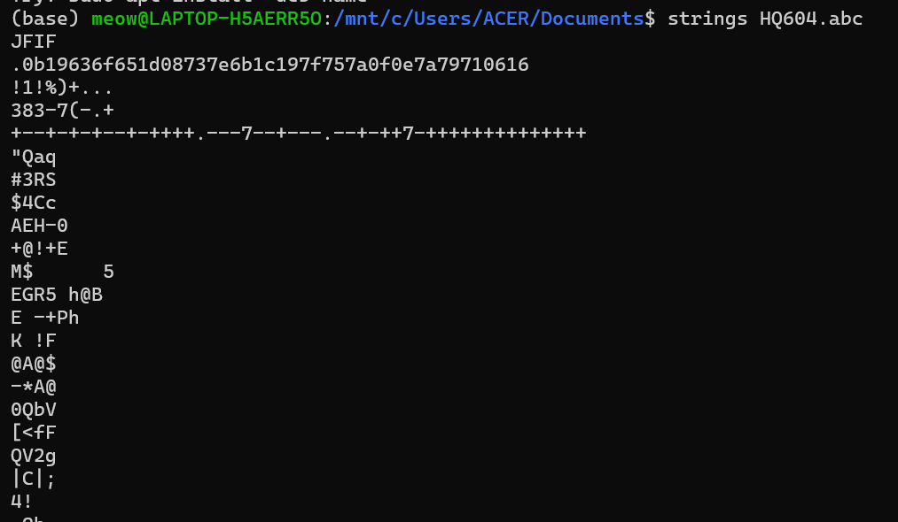
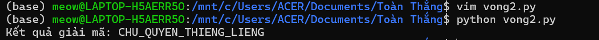

# Vòng 5 - Khúc tráng ca
## Mô tả bài toán
Ở vòng 5, đề bài cho một file có tên ```HQ604.abc```

Kèm theo gợi ý: ```Một file. Một chuỗi ký tự lạ. Và đâu đó — một chìa khóa mà bạn đã biết từ đầu.```


## Ý tưởng 
Dựa vào tên file đề bài cung cấp là ```HQ604``, em liên tưởng đến tàu HQ-604 trong trận Gạc Ma năm 1988. 

Ngoài ra, phần mô tả cũng nhắc đến Cô Lin và Len Đao, nên có thể đoán bài này liên quan đến sự kiện lịch sử ngày 14/03/1988. 

File có đuôi ```.abc```, nhưng khi kiểm tra nội dung file bằng lệnh ```strings``` thì thấy bên trong có chuỗi JFIF, đây là dấu hiệu quen thuộc của file ảnh JPEG.  


Tuy nhiên, ta còn thấy thêm một chuỗi lạ ```0b19636f651d08737e6b1c197f757a0f0e7a79710616```, suy ra bằng cách giải mã chuỗi này, ta rất có thể sẽ có được FLAG thật sự.

Dựa vào gợi ý đề bài cung cấp, đây rất có thể là một phép XOR, và khóa chính là tên file ```HQ604```.

Vì vậy, em tiến hành viết chương trình với nhiệm vụ duyệt qua từng byte của ciphertext và XOR với từng byte của key, dựa trên bản chất ```Ciphertext XOR Key = Plaintext```.

## Code
```
def xor_decrypt(hex_ciphertext, key):
    # Bước 1: Chuyển chuỗi hex thành mảng các byte
    cipher_bytes = bytes.fromhex(hex_ciphertext)

    # Bước 2: Chuyển khóa (key) thành mảng các byte
    key_bytes = key.encode('utf-8')

    decrypted_bytes = bytearray()

    # Bước 3: Duyệt qua từng byte của bản mã và XOR với từng byte của khóa
    for i in range(len(cipher_bytes)):
        # Dùng phép chia lấy dư (%) để lặp lại khóa khi bản mã dài hơn khóa
        decrypted_byte = cipher_bytes[i] ^ key_bytes[i % len(key_bytes)]
        decrypted_bytes.append(decrypted_byte)

    # Bước 4: Chuyển mảng byte kết quả thành chuỗi văn bản (bỏ qua các ký tự lỗi nếu có)
    return decrypted_bytes.decode('utf-8', errors='ignore')

# Dữ liệu từ đề bài
hex_data = "0b19636f651d08737e6b1c197f757a0f0e7a79710616"
secret_key = "HQ604"

flag = xor_decrypt(hex_data, secret_key)
print(f"Kết quả giải mã: {flag}")
```

## Kết quả
Sau khi chạy file Python, chương trình trả về:


Vì vậy, ta có Flag: `FLAG{CHU_QUYEN_THIENG_LIENG}`